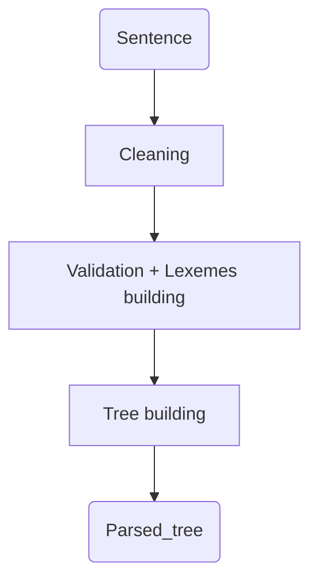

# gui-parser

Messy code I know.

## What is it ?
This is a program that aims at having a better understanding of the main steps of parsing with a graphical approach.

For now it only displays a simple graph of the tokenized sentence after the sentence is written in the input.

The following graph shows the full process that has been realized for now :

The following grammar is used to build the parsed tree :

$$<expression> ::= <variable> | <operation> | <block>$$
$$<block> ::= <start\_block> <expression> <end_block>$$
$$<operation> ::= <monadic> | <duadic>$$
$$<monadic> ::= <monadic\_operator> <expression>$$
$$<duadic> ::= <expression> <duadic\_operator> <expression>$$
$$<variable> ::= /[A-Za-z][A-Za-z0-9]\^/$$
$$<monadic\_operator> ::= <not>$$
$$<duadic\_operator> ::= <and> | <or>$$
$$<start_block> ::= ($$
$$<end_block> ::= )$$
$$<not> ::= !$$
$$<and> ::= \&\&$$
$$<or> ::= ||$$

## Notes
You need to download the p5js min file in order to make it work, when downloaded place the file in `./render/libraries/`